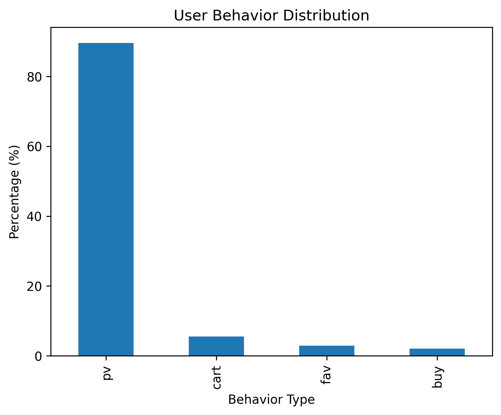
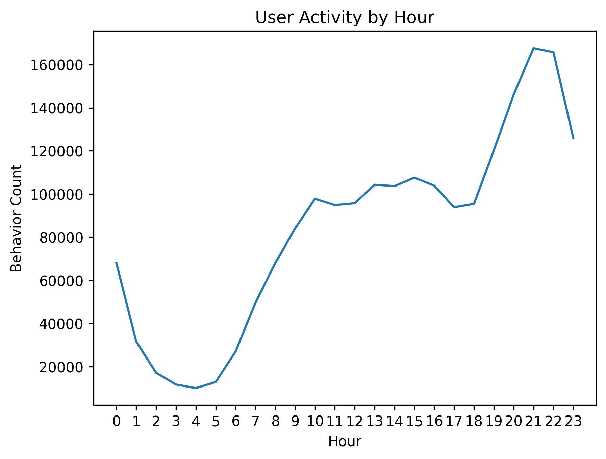
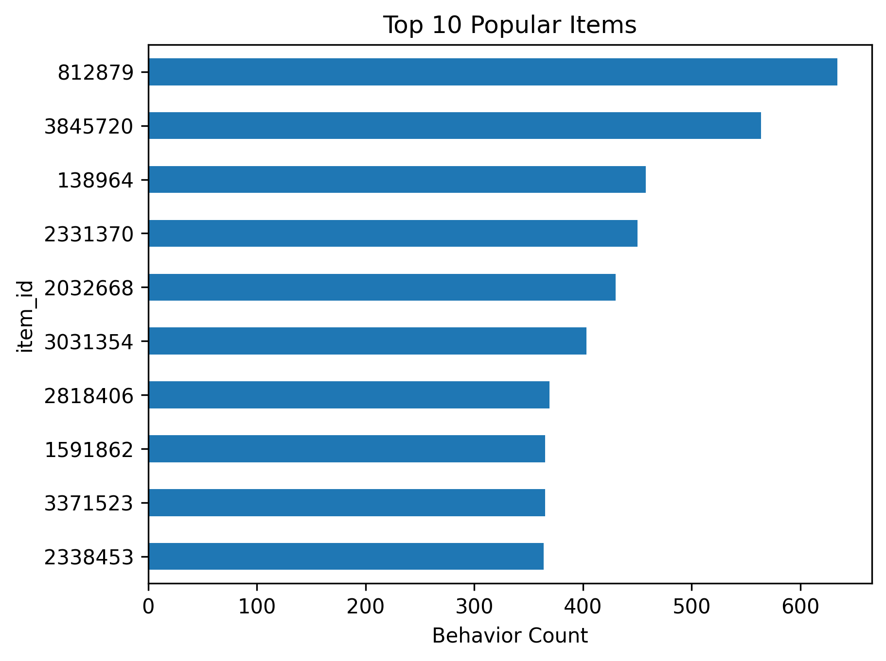
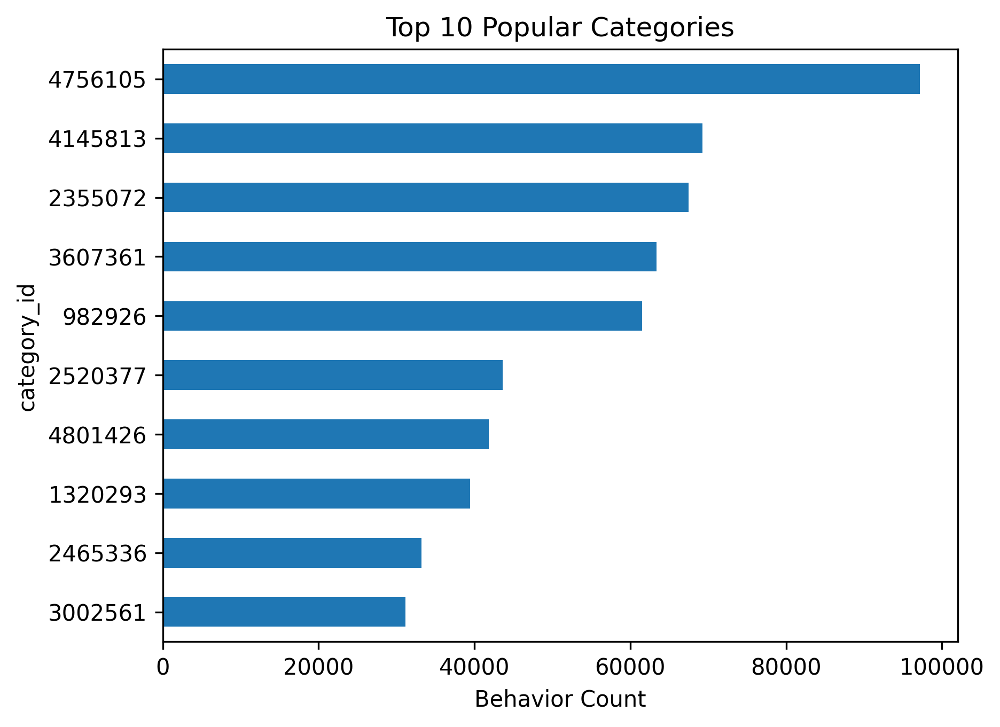
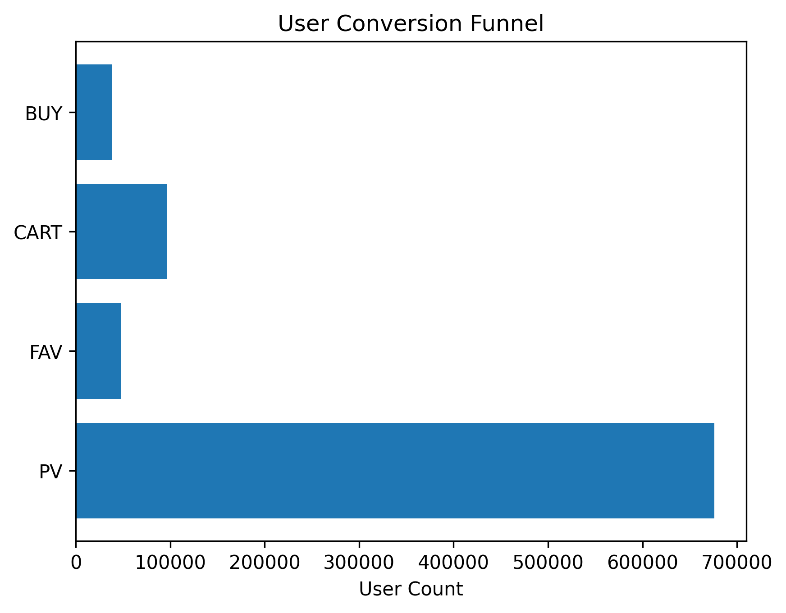
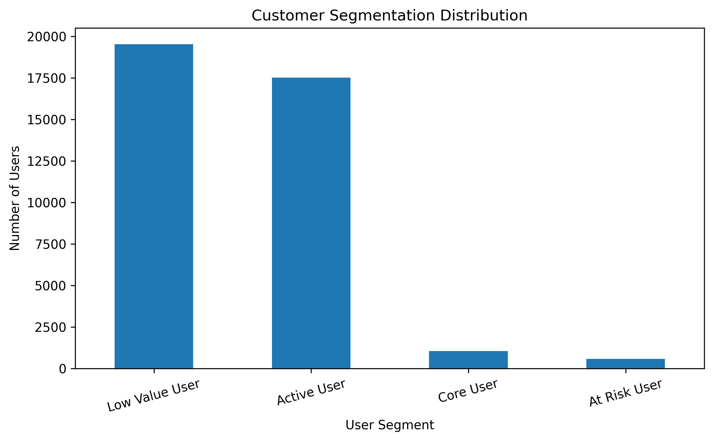
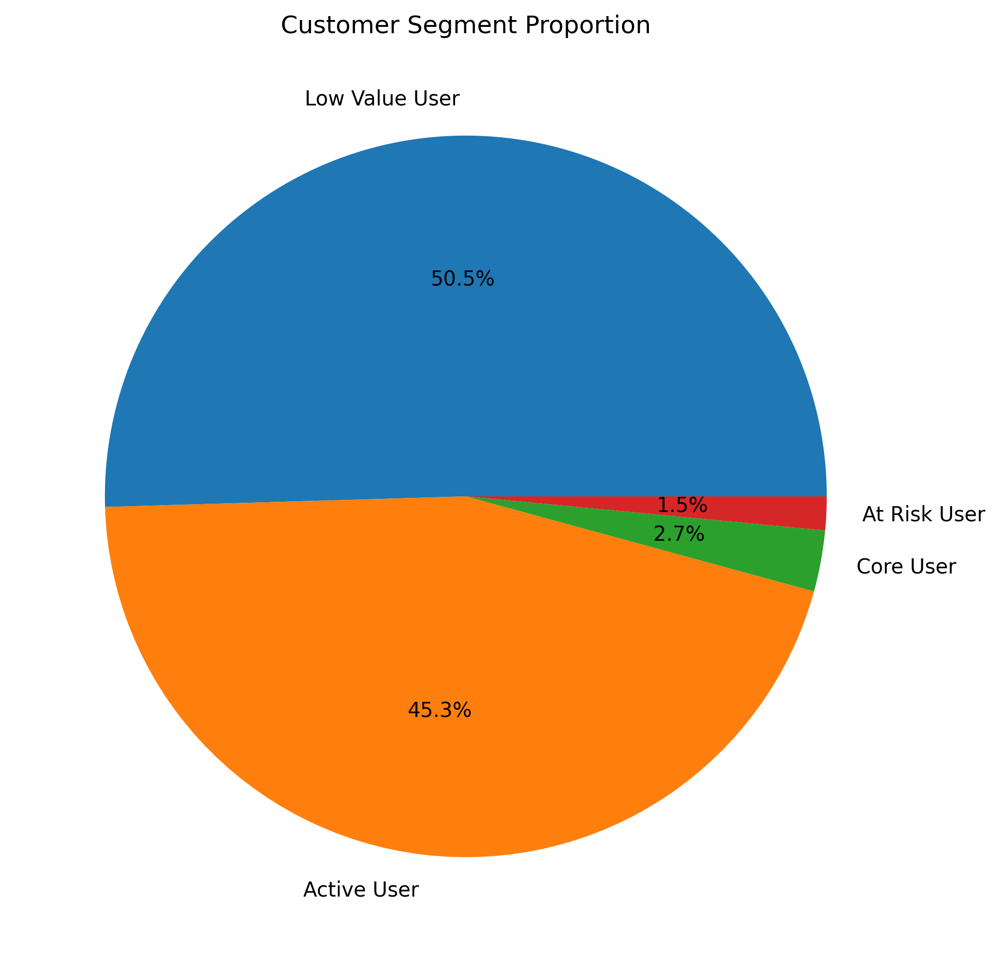
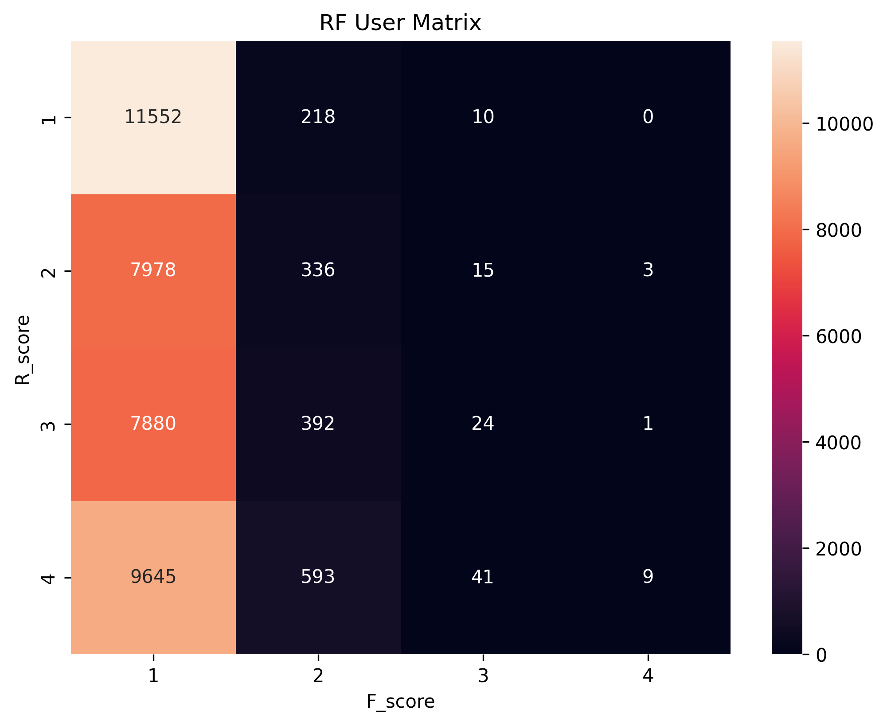

# 🛒 E-commerce User Behavior Analysis
## Full Report

See: [Final Report](report/final_report.md)
## Project Overview

This project is based on the Alibaba Tianchi UserBehavior Dataset and aims to analyze user behavior patterns on an e-commerce platform through data cleaning, exploratory analysis, conversion analysis, and customer segmentation.

The objective is to uncover user behavioral characteristics, identify key conversion bottlenecks, and provide actionable business recommendations for user growth and precision marketing.

The project was completed using Python, Pandas, Matplotlib, and Jupyter Notebook.

---

## Business Background

In e-commerce platforms, user behavior data records every interaction between customers and products, including browsing, collecting, adding to cart, and purchasing.

Analyzing these behavioral data can help answer several important business questions:

* When are users most active?
* What products and categories are most popular?
* How efficient is the conversion process?
* Which users contribute the most value?
* How should different user groups be operated?

This project attempts to answer these questions using real-world user behavior data.

---

## Dataset Description

### Data Source

Alibaba Tianchi UserBehavior Dataset

### Original Dataset Fields

| Column        | Description         |
| ------------- | ------------------- |
| user_id       | User ID             |
| item_id       | Product ID          |
| category_id   | Product Category ID |
| behavior_type | User Behavior Type  |
| timestamp     | Unix Timestamp      |

### Behavior Types

| Behavior | Meaning     |
| -------- | ----------- |
| pv       | Page View   |
| fav      | Favorite    |
| cart     | Add to Cart |
| buy      | Purchase    |

### Data Scale

After random sampling:

* Total Records: 2,003,016
* Unique Users: 676,221
* Purchase Users: 38,697

---

## Project Structure

```text
Ecommerce_User_Analysis/

├── data/
│   ├── sample.csv
│   └── cleaned_data.csv
│
├── notebook/
│   ├── 00_prepare_data.ipynb
│   ├── 01_data_cleaning.ipynb
│   ├── 02_behavior_analysis.ipynb
│   ├── 03_conversion_analysis.ipynb
│   └── 04_RFM_analysis.ipynb
│
├── figures/
│   ├── Customer_Segment_Proportion.png
│   ├── Customer_Segmentation_Distribution.png
│   ├── RF_User_Matrix.png
│   ├── Top_10_Popular_Categories.png
│   ├── Top_10_Popular_Items.png
│   ├── User_Activity_by_Hour.png
│   ├── User_Activity_by_Weekday.png
│   ├── User_Behavior_Distribution.png
│   ├── User_Conversion_Funnel.png
│
├── report/
│   ├── final_report.md   
│
├── README.md
│
├── requirements.txt
│
└── .gitignore
```

---

## Methodology

### 1. Data Preparation

* Random sampling from original dataset
* Timestamp conversion
* Missing value inspection
* Duplicate value inspection
* Feature engineering

Generated Features:

* datetime
* date
* hour
* weekday

---

### 2. User Behavior Analysis

Analyzed:

* User behavior distribution
* Hourly activity distribution
* Top-selling products
* Top-performing categories

### Key Findings

#### User Behavior Distribution

| Behavior | Percentage |
| -------- | ---------- |
| PV       | 89.57%     |
| Cart     | 5.51%      |
| Fav      | 2.90%      |
| Buy      | 2.02%      |

Most platform interactions are browsing activities.


#### User Activity Pattern

User activity peaks during evening hours, indicating that users tend to browse and shop after work or study hours.

This insight may support marketing campaign scheduling.


---

### 3. Conversion Analysis

A simplified user conversion model was constructed.

#### User Funnel

| Stage |   Users |
| ----- | ------: |
| PV    | 676,221 |
| FAV   |  48,190 |
| CART  |  96,281 |
| BUY   |  38,697 |


#### Conversion Metrics

* Favorite Rate: 7.13%
* Cart Rate: 14.24%
* Purchase Rate: 5.72%

#### Insights

* Large traffic volume exists at the browsing stage.
* Cart users show significantly stronger purchase intent than favorite users.
* Approximately 40% of cart users eventually completed purchases.

---

### 4. RF Customer Segmentation

Because transaction amount information was unavailable, a simplified RF model was adopted.

#### RF Definition

**Recency (R)**

Days since last purchase.

**Frequency (F)**

Number of purchases.

#### Customer Segments

| Segment        |  Users |
| -------------- | -----: |
| Low Value User | 19,530 |
| Active User    | 17,525 |
| Core User      |  1,060 |
| At Risk User   |    582 |



#### Segmentation Logic

Core User:

* Recent purchase
* High purchase frequency

Active User:

* Recent purchase
* Low purchase frequency

At Risk User:

* Historically frequent purchases
* Recent inactivity

Low Value User:

* Low frequency
* Low recency score

---

## Key Business Insights

### Insight 1

User structure exhibits a clear pyramid distribution.

More than 95% of users are low-frequency buyers, while only a small percentage belong to the core customer group.

### Insight 2

The shopping cart acts as the most important transition point between user interest and purchase.

### Insight 3

Active users account for a large proportion of the customer base and represent the primary opportunity for customer value growth.

### Insight 4

At-risk users should be prioritized for retention campaigns because reactivating existing customers is generally more cost-effective than acquiring new ones.

---

## Business Recommendations

### For Core Users

* Membership programs
* Exclusive rewards
* Loyalty incentives

### For Active Users

* Personalized recommendations
* Product bundles
* Promotional campaigns

### For At-Risk Users

* Coupon reminders
* Re-engagement campaigns
* Price-drop notifications

### For Low-Value Users

* New user incentives
* Gamified engagement activities
* Product discovery recommendations

---

## Technologies Used

* Python
* Pandas
* NumPy
* Matplotlib
* Seaborn
* Jupyter Notebook

---

## Future Improvements

Potential extensions include:

* Cohort Analysis
* Retention Analysis
* Customer Lifetime Value (CLV)
* Product Recommendation System
* Machine Learning Based Purchase Prediction

---

## Author

Xin Huang